# Vehicle License Plate Number Extraction
Trained YOLOv11 on `custom dataset` of license plates with `ultralytics` and used tesseract to extract vehicle number from the license plate

#### *`Dataset`*
Download the License Plate Dataset from [here](https://universe.roboflow.com/roboflow-universe-projects/license-plate-recognition-rxg4e/dataset/4)

#### *`Detection and Extraction On Video`*
shown as gif (github doesn't display videos)

#### *`Detection and Extraction On Images`*
|               |		        |
| ------------- |:-------------:|
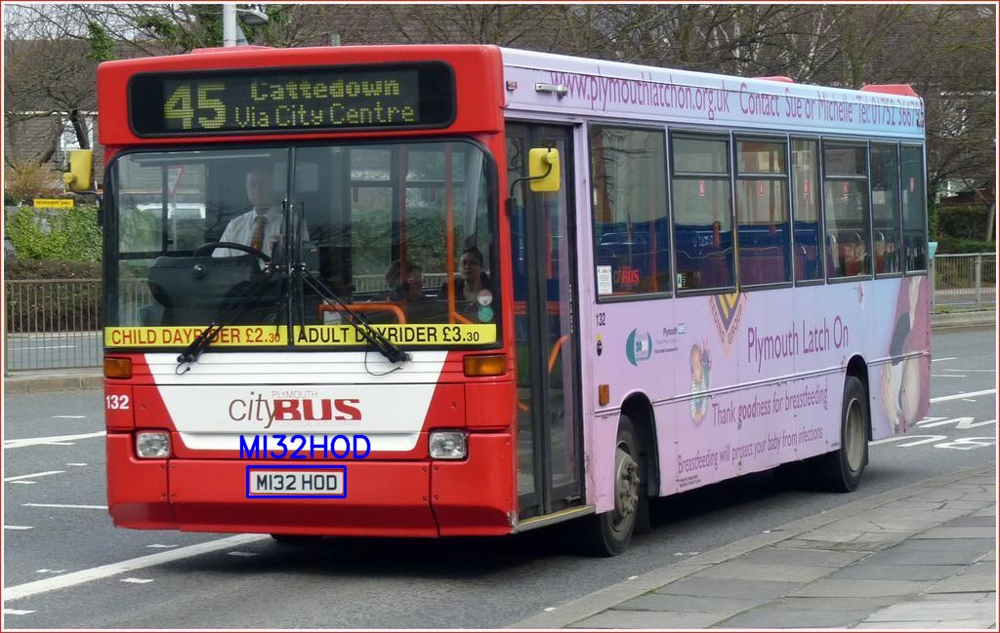 | 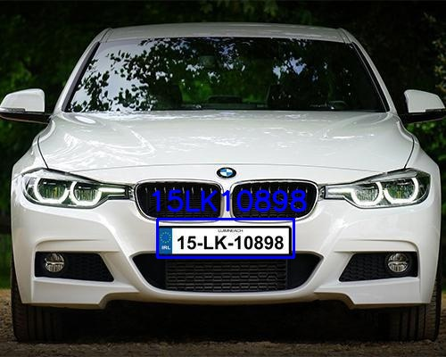 
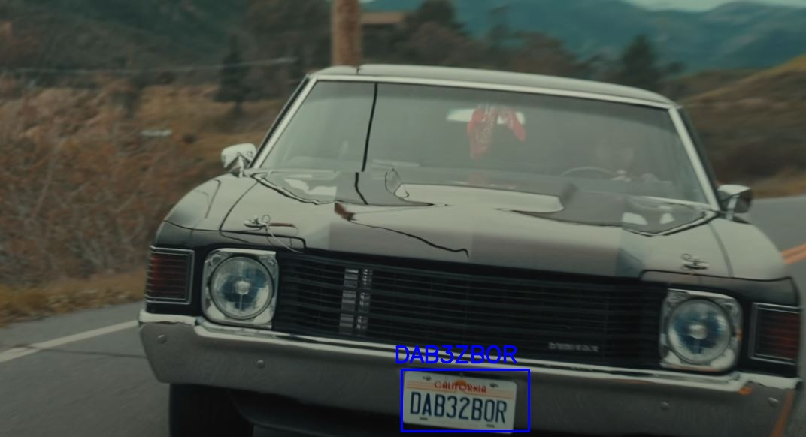  | 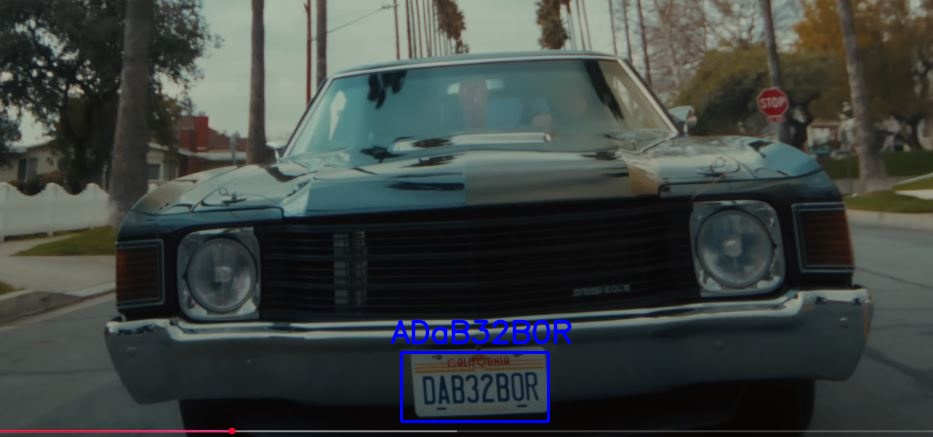 
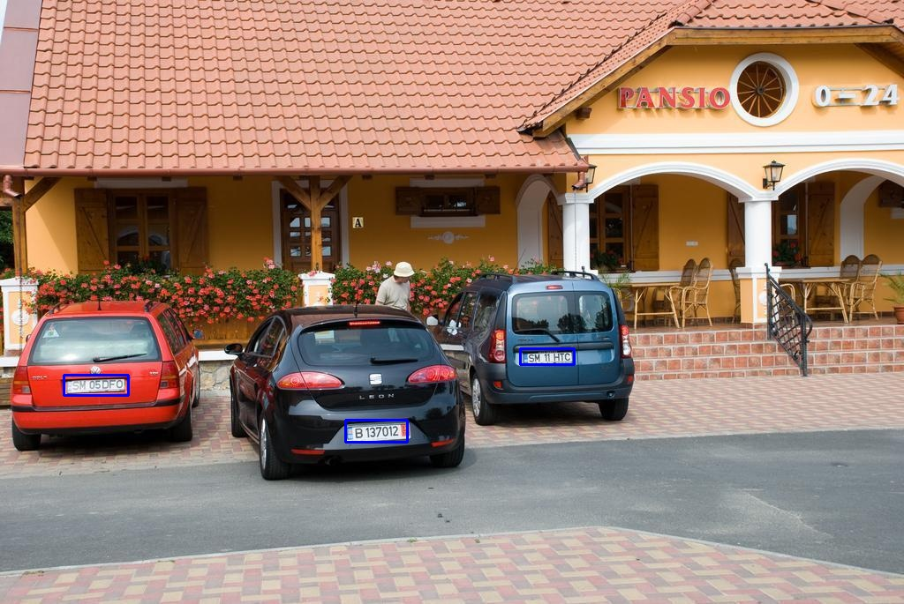  | 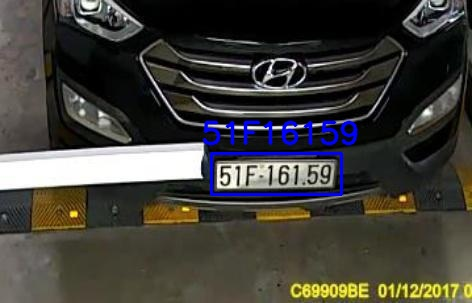 

### *`Training Results By Ultralytics`*
I didn't have enough space in my C: to install CUDA and NVIDIA for some reason doesn't let you choose another drive.  
So I trained it on CPU for 5 Epochs and it took 22 hours.
|               |		        |
| ------------- |:-------------:|
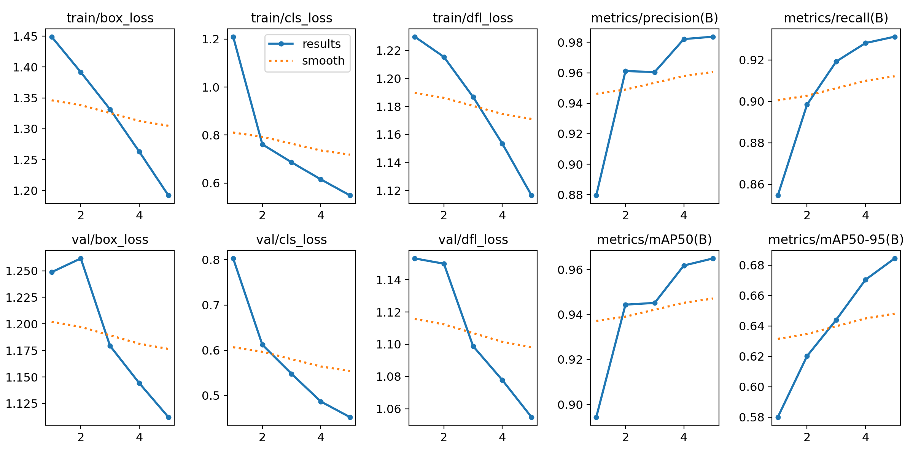 | 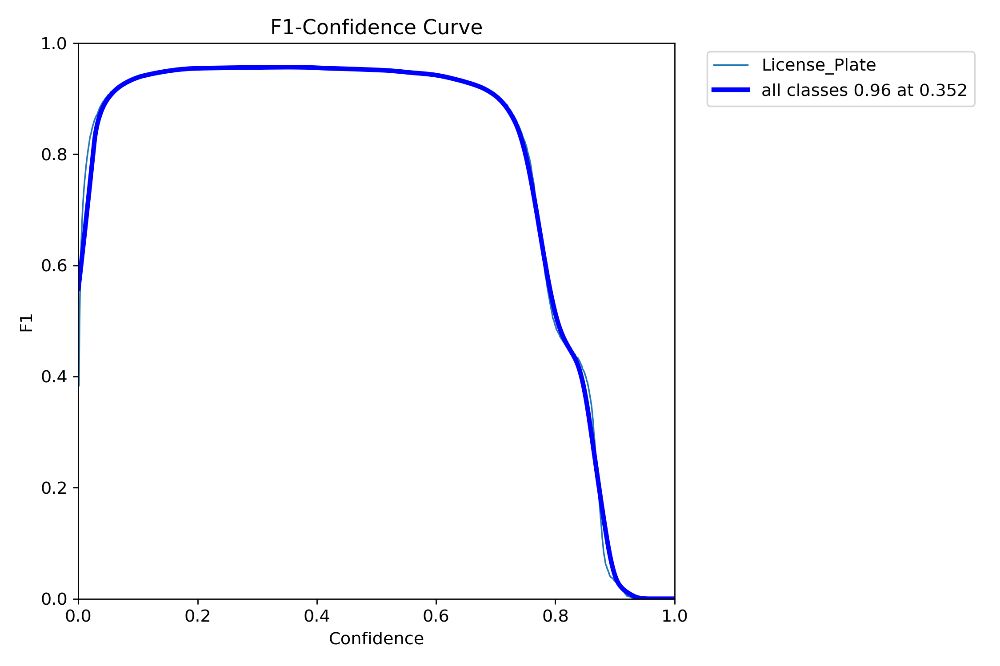 
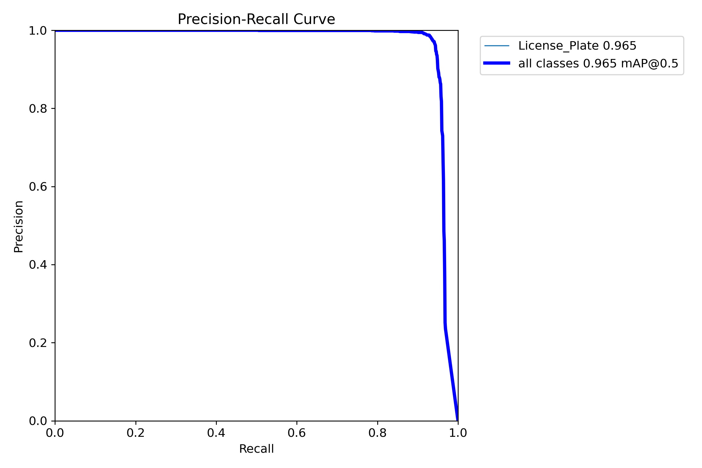  | 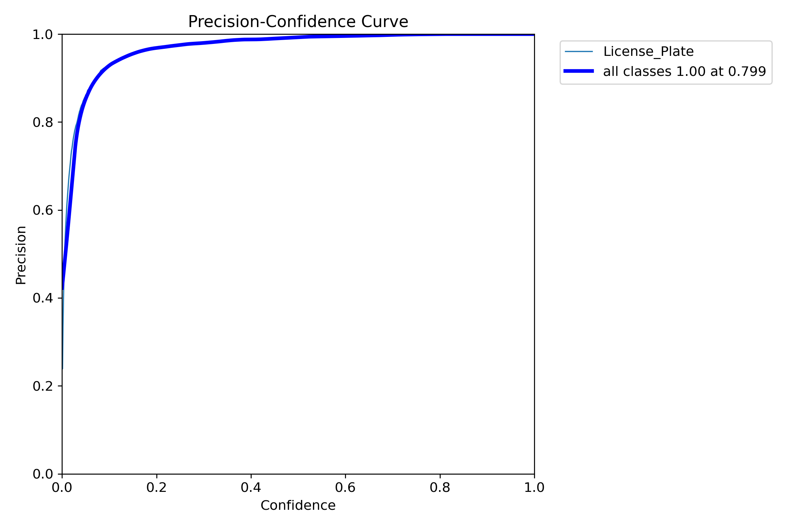 
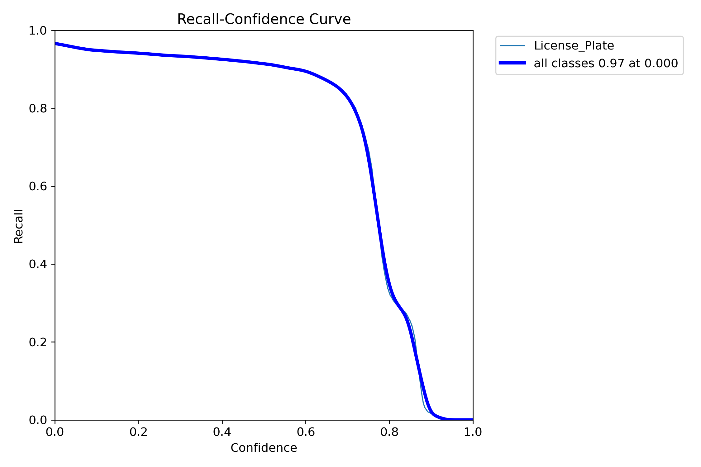  |  
  | 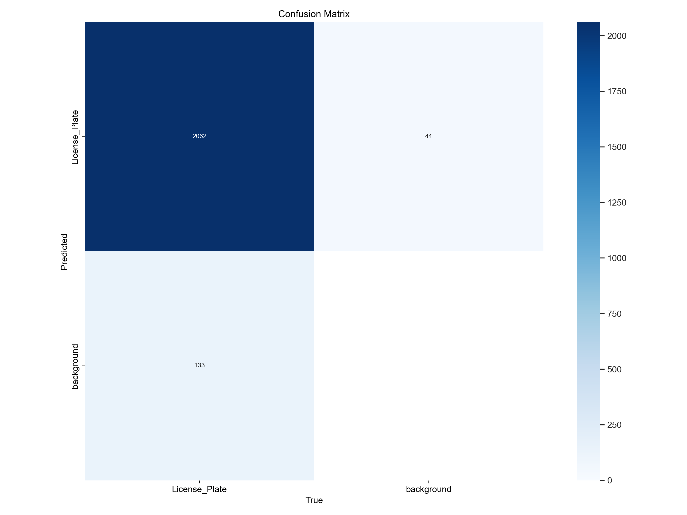 

# Future Work
* [ ] Add GUI.
* [ ] Add more object detection models other than YOLO.
* [ ] Live detection and extraction.

# Requirements
os  
ultralytics  
cv2  
re  
pytesseract  
tqdm

# References
Guided by this [Youtube Tutorial](https://www.youtube.com/watch?v=POmyidzahLg)  
